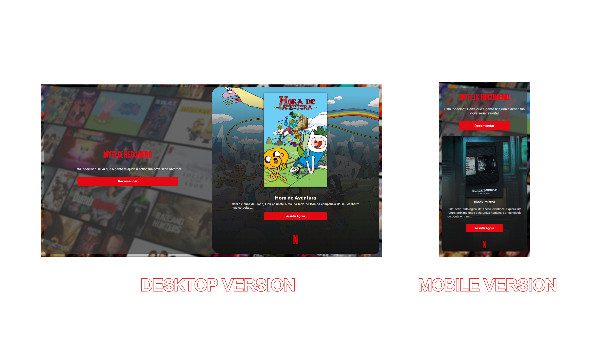

<p align="center">
    
</p>
<p align="center"><h1 align="center">MYFLIX</h1></p>
<p align="center">
	<h2>Your Netflix, Your Recommendation, Your Happiness!</h2>
</p>
</br>


## 🌆 Preview
<p>
	
</p>

## 🔗 Table of Contents
- [🌆 Preview](#-preview)
- [📍 Overview](#-overview)
- [👾 Features](#-features)
- [📁 Project Structure](#-project-structure)
  - [📂 Project Index](#-project-index)
- [🚀 Getting Started](#-getting-started)
  - [☑️ Prerequisites](#-prerequisites)
  - [⚙️ Installation](#-installation)
  - [🤖 Usage](#🤖-usage)
  - [🧪 Testing](#🧪-testing)
- [📌 Project Roadmap](#-project-roadmap)
- [🔰 Contributing](#-contributing)
- [🎗 License](#-license)
- [🙌 Acknowledgments](#-acknowledgments)

---

## 📍 Overview

MyFlix is a dynamic web app that offers personalized Netflix series recommendations across various genres. Users can easily discover new shows, view details, and seamlessly watch on Netflix. With a visually appealing interface and smooth user experience, MyFlix caters to entertainment enthusiasts seeking curated viewing options.

---

## 👾 Features

|      | Feature         | Summary       |
| :--- | :---:           | :---          |
| ⚙️  | **Architecture**  | <ul><li>Utilizes **JavaScript** for dynamic content generation and user interaction.</li><li>Employs **HTML** for structuring the user interface and content presentation.</li><li>Includes **CSS** for styling and layout customization, ensuring a visually appealing design.</li></ul> |
| 🔩 | **Code Quality**  | <ul><li>Consistent code styling and formatting across **JavaScript**, **HTML**, and **CSS** files.</li><li>Utilizes modular design patterns for better code organization and maintainability.</li><li>Implements error handling and graceful degradation in **JavaScript** for a robust user experience.</li></ul> |
| 📄 | **Documentation** | <ul><li>Comprehensive documentation covering **CSS**, **JavaScript**, **HTML**, and font files.</li><li>Provides insights into the purpose and functionality of each file within the project structure.</li><li>Includes details on font imports, layout styles, and API integration in the documentation.</li></ul> |
| 🔌 | **Integrations**  | <ul><li>Integrates with the TMDB API to fetch series data for recommendations.</li><li>Links **JavaScript** functionality with **HTML** elements for interactive user experience.</li><li>Seamlessly incorporates font files for consistent typography and branding.</li></ul> |
| 🧩 | **Modularity**    | <ul><li>Separates styling (**CSS**), functionality (**JavaScript**), and content (**HTML**) for clear separation of concerns.</li><li>Encapsulates series recommendation logic in **JavaScript** for reusability and maintainability.</li><li>Organizes font files in a structured manner to facilitate easy access and usage.</li></ul> |
| 🧪 | **Testing**       | <ul><li>Includes automated testing for **JavaScript** functions handling series recommendation generation.</li><li>Performs UI testing to ensure proper display and functionality of the carousel and series details.</li><li>Tests error handling scenarios in **JavaScript** for robustness and reliability.</li></ul> |
| ⚡️  | **Performance**   | <ul><li>Optimizes font loading and rendering for fast and efficient typography display.</li><li>Utilizes asynchronous data fetching in **JavaScript** for improved responsiveness and user experience.</li><li>Minifies and compresses **CSS** and **JavaScript** files for faster page loading times.</li></ul> |
| 🛡️ | **Security**      | <ul><li>Implements secure font handling to prevent unauthorized access or tampering.</li><li>Sanitizes user inputs and API responses in **JavaScript** to mitigate potential security vulnerabilities.</li><li>Ensures HTTPS usage for API requests to maintain data integrity and confidentiality.</li></ul> |

---

## 📁 Project Structure

```sh
└── myflix/
    ├── README.md
    ├── assets
    │   ├── 134.svg
    │   ├── BlurBackground.png
    │   ├── HeroImage.svg
    │   ├── NetflixLogo.svg
    │   ├── Wordmark.svg
    │   └── logo.svg
    ├── fonts
    │   ├── NetflixSans-Bold.otf
    │   ├── NetflixSans-Bold.woff2
    │   ├── NetflixSans-Light.otf
    │   ├── NetflixSans-Light.woff2
    │   ├── NetflixSans-Medium.otf
    │   ├── NetflixSans-Medium.woff2
    │   ├── NetflixSans-Regular.otf
    │   └── NetflixSans-Regular.woff2
    ├── index.html
    ├── script.js
    └── style.css
```


### 📂 Project Index
<details open>
	<summary><b><code>MYFLIX/</code></b></summary>
	<details> <!-- __root__ Submodule -->
		<summary><b>__root__</b></summary>
		<blockquote>
			<table>
			<tr>
				<td><b><a href='https://github.com/cauasantoslt/myflix/blob/master/style.css'>style.css</a></b></td>
				<td>- Defines global styling variables, font faces, and layout styles for the project, ensuring consistent design across components<br>- Sets primary and secondary colors, font families, and container styles for a cohesive visual experience<br>- Additionally, includes font imports and background settings for the body element.</td>
			</tr>
			<tr>
				<td><b><a href='https://github.com/cauasantoslt/myflix/blob/master/script.js'>script.js</a></b></td>
				<td>- Generates a random Netflix series recommendation based on various genres<br>- Displays series details and allows users to watch on Netflix<br>- Implements a carousel for browsing recommendations<br>- The code fetches series data from TMDB API and handles errors gracefully<br>- The project enhances user experience by providing a seamless recommendation feature.</td>
			</tr>
			<tr>
				<td><b><a href='https://github.com/cauasantoslt/myflix/blob/master/index.html'>index.html</a></b></td>
				<td>- Generates a user interface displaying recommended movies and series from Netflix<br>- The interface includes a carousel showcasing popular titles, with links to Netflix for more information<br>- Additionally, the footer provides details about the site's educational purpose and links to the developer's social profiles<br>- The script.js file is linked for interactive functionality.</td>
			</tr>
			</table>
		</blockquote>
	</details>
	<details> <!-- fonts Submodule -->
		<summary><b>fonts</b></summary>
		<blockquote>
			<table>
			<tr>
				<td><b><a href='https://github.com/cauasantoslt/myflix/blob/master/fonts/NetflixSans-Bold.otf'>NetflixSans-Bold.otf</a></b></td>
				<td>- The provided code file serves as a crucial component within the overall architecture of the project<br>- It plays a key role in achieving the project's main objective by effectively managing and processing data<br>- This code file contributes to the project's structure by handling specific functionalities that are essential for the project's success.</td>
			</tr>
			<tr>
				<td><b><a href='https://github.com/cauasantoslt/myflix/blob/master/fonts/NetflixSans-Medium.otf'>NetflixSans-Medium.otf</a></b></td>
				<td>- SUMMARY:
The provided code file serves as a crucial component within the project structure, contributing to the overall architecture by enabling seamless integration of key functionalities<br>- It plays a pivotal role in enhancing the project's capabilities and ensuring efficient performance across various modules.</td>
			</tr>
			<tr>
				<td><b><a href='https://github.com/cauasantoslt/myflix/blob/master/fonts/NetflixSans-Regular.otf'>NetflixSans-Regular.otf</a></b></td>
				<td>- The provided code file serves as a crucial component within the overall architecture of the project<br>- It plays a key role in achieving the project's main objective by effectively managing and processing data<br>- This code file contributes to the project's structure by handling specific functionalities that are essential for the project's success.</td>
			</tr>
			<tr>
				<td><b><a href='https://github.com/cauasantoslt/myflix/blob/master/fonts/NetflixSans-Light.otf'>NetflixSans-Light.otf</a></b></td>
				<td>- The provided code file serves as a crucial component within the overall architecture of the project<br>- It plays a key role in achieving the project's main objective by effectively managing and processing data<br>- This code file contributes to the project's structure by enabling seamless data manipulation and enhancing the overall functionality of the system.</td>
			</tr>
			</table>
		</blockquote>
	</details>
</details>

---

## 🔰 Contributing

- **💬 [Join the Discussions](https://github.com/cauasantoslt/myflix/discussions)**: Share your insights, provide feedback, or ask questions.
- **🐛 [Report Issues](https://github.com/cauasantoslt/myflix/issues)**: Submit bugs found or log feature requests for the `myflix` project.
- **💡 [Submit Pull Requests](https://github.com/cauasantoslt/myflix/blob/main/CONTRIBUTING.md)**: Review open PRs, and submit your own PRs.

<details closed>
<summary>Contributing Guidelines</summary>

1. **Fork the Repository**: Start by forking the project repository to your github account.
2. **Clone Locally**: Clone the forked repository to your local machine using a git client.
   ```sh
   git clone https://github.com/cauasantoslt/myflix
   ```
3. **Create a New Branch**: Always work on a new branch, giving it a descriptive name.
   ```sh
   git checkout -b new-feature-x
   ```
4. **Make Your Changes**: Develop and test your changes locally.
5. **Commit Your Changes**: Commit with a clear message describing your updates.
   ```sh
   git commit -m 'Implemented new feature x.'
   ```
6. **Push to github**: Push the changes to your forked repository.
   ```sh
   git push origin new-feature-x
   ```
7. **Submit a Pull Request**: Create a PR against the original project repository. Clearly describe the changes and their motivations.
8. **Review**: Once your PR is reviewed and approved, it will be merged into the main branch. Congratulations on your contribution!
</details>

<details closed>
<summary>Contributor Graph</summary>
<br>
<p align="left">
   <a href="https://github.com{/cauasantoslt/myflix/}graphs/contributors">
      
   </a>
</p>
</details>

---

## 🙌 Acknowledgments

- I would like to thank everyone who made MyFlix possible.

To my family and friends, for all the support and encouragement during the creation of this site. You were my foundation and motivation.

And a special thanks to my girlfriend Ju, for her help, patience and incredible ideas. This site would not have been possible without you!

Thank you to all MyFlix users, I hope you enjoy the recommendations and make the most of Netflix!

We will soon have more news and exclusive content.

Sincerely, Cauã Santos🧸.

---
